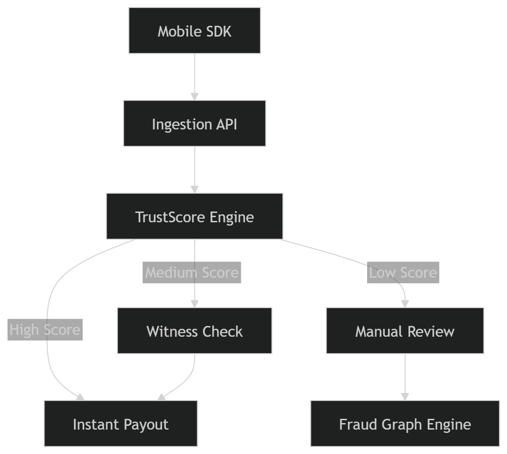
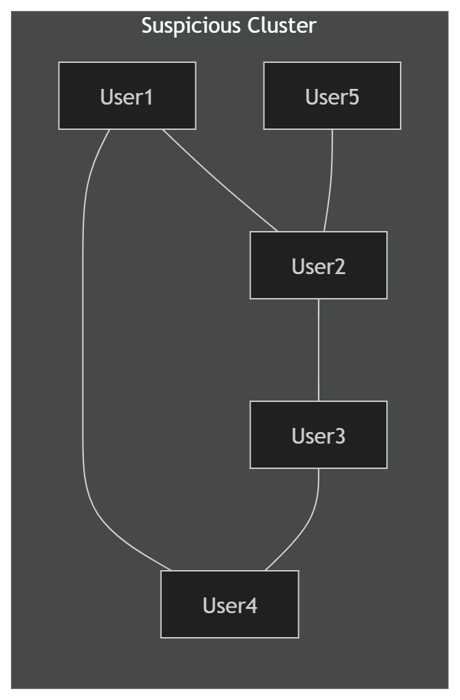

🌩️ StormSafe
Parametric Weather Insurance for Gig Workers

DEVTrails 2026 | Phase 1 Submission

📑 Table of Contents

1.Problem Statement Breakdown 
2.Adversarial Defense & Anti-Spoofing Strategy 
    2.1 The Differentiation (Architecture, Flows, Tables) 
    2.2 The Data 
    2.3 The UX Balance 
3.Conclusion 

1. 🚨 Problem Statement Breakdown

India’s gig economy has 15M+ delivery workers who face a critical choice during severe weather (cyclones, floods, storms):

workers face a binary choice:
| Option           | Outcome            |
| ---------------- | ------------------ |
| Continue working | Risk life & safety |
| Stop working     | Lose daily income  |

Why Traditional Insurance Fails

Manual claims

Proof collection impossible in storms

Slow payouts

High friction

1.3 Parametric Insurance — The Ideal Solution

Parametric insurance solves this via:
    IF weather trigger == TRUE
    THEN payout automatically

Example:

    IMD Red Alert in a region
    Rainfall threshold exceeded

    ✔ No paperwork
    ✔ No claim filing
    ✔ Payout in ~90 seconds

1.4 The Critical Vulnerability

⚠️ The 500-Worker Syndicate Attack
A coordinated fraud ring exploited the system by:

    Using GPS spoofing apps
    Simulating presence in storm zones
    Coordinating via Telegram
    Triggering mass false claims

Result:
    Entire liquidity pool drained
    System collapse

1.5 Root Cause

The failure stems from:
❌ Single Point of Failure: GPS

| Assumption            | Reality               |
| --------------------- | --------------------- |
| GPS = Truth           | GPS is spoofable      |
| One device = one user | Device farms exist    |
| Location = presence   | Location can be faked |

1.7 Core Problem Statement

How do we verify that a worker is physically present in a dangerous weather environment — in real-time — in a way that cannot be spoofed at scale?

2. 🛡️ Adversarial Defense & Anti-Spoofing Strategy

2.1 🔍 The Differentiation

2.1.1 System Philosophy

Trust physical reality → Multi-signal validation → Score → Decide

Architecture Flow

2.1.2 Multi-Layer Defense

StormSafe replaces GPS-only verification with:

    Visual Proof → Detect rain, lighting, outdoor conditions 
    Audio Signals → Identify storm acoustics 
    Network Validation → Cell tower vs GPS consistency 
    Social Proof → Witness confirmation 
    Economic Layer → Staking discourages fraud 

2.1.3 Genuine vs Spoofer

| Signal   | Genuine Worker     | Spoofer    |
| -------- | ------------------ | ---------- |
| Camera   | Rain / outdoor     | Indoor     |
| Audio    | Storm noise        | Artificial |
| Location | Consistent signals | Mismatch   |
| Motion   | High entropy       | Flat       |
| Behavior | Natural            | Scripted   |

2.1.4 Behavioral Intelligence

ML models (LSTM / Random Forest) analyze:

    a. Motion entropy
    b. Touch patterns
    c. Sensor noise

Genuine users show irregular, high-variance behavior, while spoofers exhibit predictable patterns.

2.1.5 Fraud Graph Engine

Nodes: users/devices
Edges: shared signals, timing

IF cluster >10 users in <5 min → freeze cluster

2.1.6 Environmental Consistency

Validates real-world physics:

    a. Signal degradation 
    b. Noise fluctuations
    c. Barometric pressure

Real storms change physical conditions — spoofers cannot replicate this reliably.

2.1.7 Witness Protocol
Flagged claim → Nearby worker check → Confirm → Approve / Escalate

2.1.8 Staking Model

Fraud becomes economically irrational:

Genuine → full payout 
Suspicious → partial payout 
Fraud → stake burned 

2.2 📊 The Data

2.2.1 Multi-Modal Location

Location = GPS + Cell Tower + WiFi + Sensor Data

Data Sources

    a. GPS (GNSS)
    b. Cell towers
    c. Weather APIs
    d. Audio & video
    e. IMU sensors
    f. Barometer

2.2.2 Key Enhancements

    a. Hardware-backed attestation (TEE, Secure Enclave)
    b. BLE proximity detection
    c. Graph-based behavioral tracking
    d. Adversarial ML training (+27% robustness)

2.3 🎯 UX Balance

2.3.1 Core Principle 
Security must not punish honest users.

2.3.2 UX Flow

Tap "I'm Stranded" → 5-sec check → Approve / Flag

2.3.3 Outcomes

| Result   | User Experience              |
| -------- | ---------------------------- |
| Approved | Instant payout               |
| Flagged  | Partial payout + quick check |
| Review   | Manual verification          |

2.3.4 UX Features

    a. Offline logging + secure sync
    b. Multilingual support
    c. Transparent communication
    d. Partial payouts for safety

3.  Conclusion

3.1 From Reactive → Structural Defense 
Old: Detect → Ban   
New: Prevent → Disincentivize → Detect → Contain 

3.2 Key Innovations

    a. Multi-modal verification
    b. Environmental consistency modeling
    c. Graph-based fraud detection
    d. Economic deterrence (staking)
    e. Adaptive UX

3.3 Outcome
✔ Fraud becomes economically irrational 
✔ Honest workers are protected 
✔ System scales against coordinated attacks 