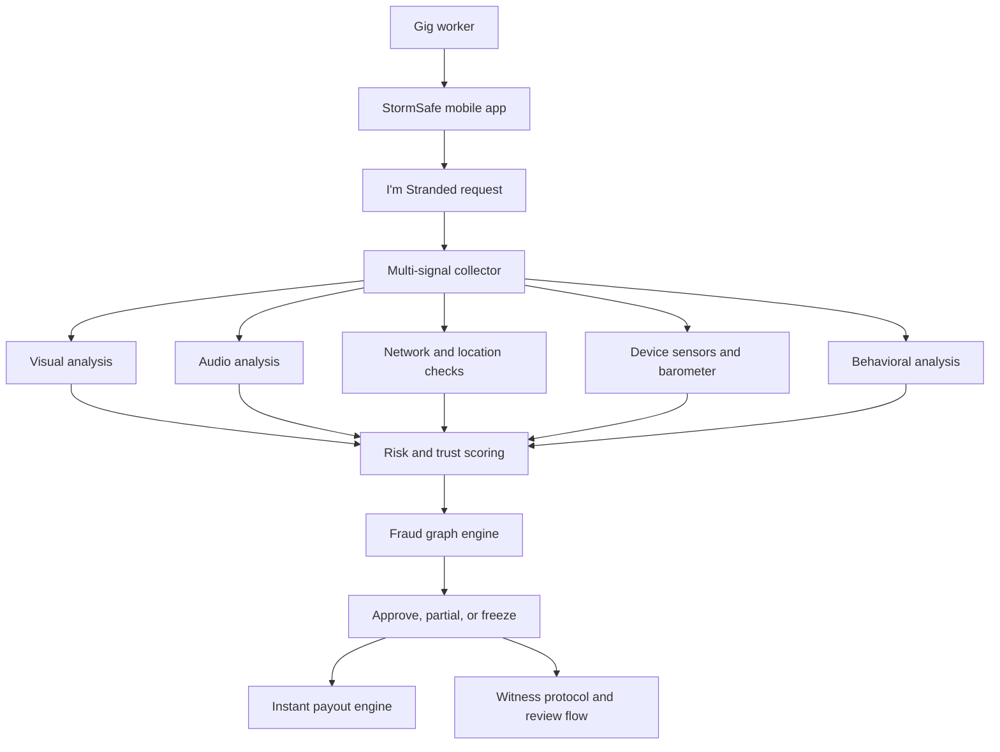
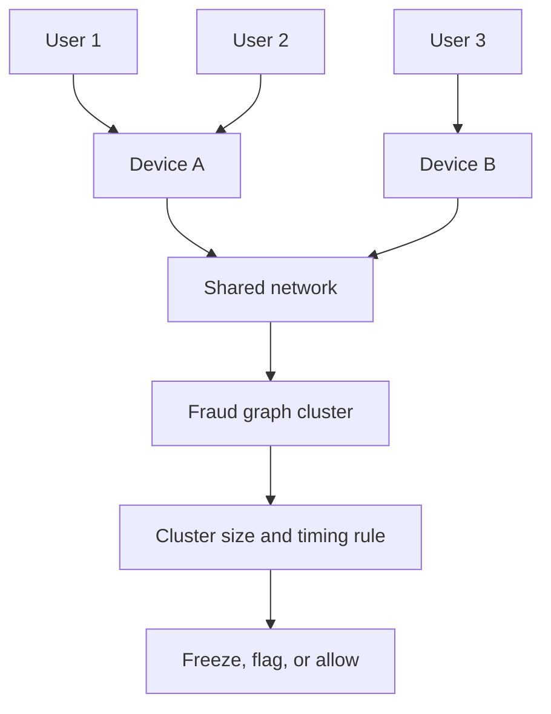

# StormSafe: Parametric Weather Insurance for Gig Workers

StormSafe is a parametric weather insurance concept tailored for gig workers operating in high-risk weather environments. It focuses on instant, automated payouts while defending against large-scale fraud and spoofing.

---

## Table of Contents

- [1. 🚨 Problem Statement Breakdown](#1--problem-statement-breakdown)
  - [1.1 The Gig Worker Weather Dilemma](#11-the-gig-worker-weather-dilemma)
  - [1.2 Why Traditional Insurance Fails](#12-why-traditional-insurance-fails)
  - [1.3 Parametric Insurance — The Ideal Solution](#13-parametric-insurance--the-ideal-solution)
  - [1.4 The Critical Vulnerability](#14-the-critical-vulnerability)
  - [1.5 Root Cause](#15-root-cause)
  - [1.7 Core Problem Statement](#17-core-problem-statement)
- [2. 🛡️ Adversarial Defense & Anti-Spoofing Strategy](#2--adversarial-defense--anti-spoofing-strategy)
  - [2.1 🔍 The Differentiation](#21--the-differentiation)
    - [2.1.1 System Philosophy](#211-system-philosophy)
    - [2.1.2 Multi-Layer Defense](#212-multi-layer-defense)
    - [2.1.3 Genuine vs Spoofer](#213-genuine-vs-spoofer)
    - [2.1.4 Behavioral Intelligence](#214-behavioral-intelligence)
    - [2.1.5 Fraud Graph Engine](#215-fraud-graph-engine)
    - [2.1.6 Environmental Consistency](#216-environmental-consistency)
    - [2.1.7 Witness Protocol](#217-witness-protocol)
    - [2.1.8 Staking Model](#218-staking-model)
  - [2.2 📊 The Data](#22--the-data)
    - [2.2.1 Multi-Modal Location](#221-multi-modal-location)
    - [2.2.2 Key Enhancements](#222-key-enhancements)
  - [2.3 🎯 UX Balance](#23--ux-balance)
    - [2.3.1 Core Principle](#231-core-principle)
    - [2.3.2 UX Flow](#232-ux-flow)
    - [2.3.3 Outcomes](#233-outcomes)
    - [2.3.4 UX Features](#234-ux-features)
- [3. ✅ Conclusion](#3--conclusion)
  - [3.1 From Reactive → Structural Defense](#31-from-reactive--structural-defense)
  - [3.2 Key Innovations](#32-key-innovations)
  - [3.3 Outcome](#33-outcome)

---

## 1. 🚨 Problem Statement Breakdown

This section describes the core risk for gig workers in severe weather and the failure of traditional insurance. It also introduces parametric insurance and the core vulnerability that attackers exploited.

### 1.1 The Gig Worker Weather Dilemma

India’s gig economy includes more than 15 million delivery workers exposed to extreme weather events. During cyclones, floods, and storms, workers face a binary and unsafe economic choice.

| Option           | Outcome            |
| ---------------- | ------------------ |
| Continue working | Risk life and safety |
| Stop working     | Lose daily income  |

This forces workers to choose between physical safety and financial survival.

### 1.2 Why Traditional Insurance Fails

Traditional insurance flows do not match real-time, high-risk gig work scenarios. Manual processes break down in storms and create heavy friction.

- Manual claims
- Proof collection impossible in extreme weather
- Slow payouts
- High friction across the journey

These properties make traditional insurance unusable at the exact moment workers need it most.

### 1.3 Parametric Insurance — The Ideal Solution

Parametric insurance triggers payouts automatically when a predefined condition occurs. It removes the need for post-event documentation and subjective claims assessment.

```text
IF weather trigger == TRUE
THEN payout automatically
```

Example triggers include:

- IMD Red Alert in a given region
- Rainfall threshold exceeded in that area

Key properties are:

- ✔ No paperwork  
- ✔ No claim filing  
- ✔ Payout in approximately 90 seconds  

This aligns with gig workers’ need for instant, low-friction support.

### 1.4 The Critical Vulnerability

A critical vulnerability emerges when attackers exploit weak verification based on location alone. A 500-worker syndicate attack illustrates this failure mode.

The fraud ring operated by:

- Using GPS spoofing apps
- Simulating presence in storm zones
- Coordinating activity via Telegram
- Triggering mass false claims simultaneously

Resulting impact:

- Entire liquidity pool drained
- System collapse under fraudulent payouts

This shows that naive parametric triggers can be economically unsustainable.

### 1.5 Root Cause

The collapse stems from an over-reliance on a single, spoofable signal. Assumptions about GPS and devices did not hold in an adversarial environment.

| Assumption            | Reality               |
| --------------------- | --------------------- |
| GPS = Truth           | GPS is spoofable      |
| One device = one user | Device farms exist    |
| Location = presence   | Location can be faked |

The system trusted a digital coordinate as proof of physical presence.

### 1.7 Core Problem Statement

The central challenge is to verify real, physical presence in dangerous weather conditions. This must work in real time and withstand coordinated, large-scale spoofing attempts.

> How do we verify that a worker is physically present in a dangerous weather environment — in real-time — in a way that cannot be spoofed at scale?

The rest of the design focuses on answering this question.

---

## 2. 🛡️ Adversarial Defense & Anti-Spoofing Strategy

This section describes how StormSafe hardens parametric payouts against adversarial behavior. It combines physical signals, behavior modeling, and economic incentives.

### 2.1 🔍 The Differentiation

StormSafe replaces single-signal trust with a multi-layer, adversarially aware architecture. It moves from trusting device-reported GPS to validating physical reality from multiple angles.

#### 2.1.1 System Philosophy

The system follows a simple decision pipeline. It anchors trust in physical reality, not just device metadata.

- Trust physical reality
- Validate with multiple independent signals
- Compute a risk or trust score
- Decide payout, flagging, or escalation

High-level architecture flow:



This flow systematically reduces reliance on any single, spoofable signal.

#### 2.1.2 Multi-Layer Defense

StormSafe replaces GPS-only verification with a stack of heterogeneous signals. Each layer captures a different aspect of real-world conditions.

- Visual proof: Detects rain, lightning, and outdoor conditions
- Audio signals: Identifies storm acoustics and ambient patterns
- Network validation: Compares cell tower and GPS consistency
- Social proof: Uses witness confirmation from nearby workers
- Economic layer: Uses staking mechanisms to discourage fraud

An attacker must simultaneously fake multiple orthogonal signals to succeed.

#### 2.1.3 Genuine vs Spoofer

The system treats each signal as a differentiator between genuine workers and spoofers. It evaluates how natural or synthetic each input appears.

| Signal   | Genuine Worker     | Spoofer    |
| -------- | ------------------ | ---------- |
| Camera   | Rain / outdoor     | Indoor     |
| Audio    | Storm noise        | Artificial |
| Location | Consistent signals | Mismatch   |
| Motion   | High entropy       | Flat       |
| Behavior | Natural            | Scripted   |

This matrix summarizes intuitive differences that models can exploit.

#### 2.1.4 Behavioral Intelligence

Behavioral intelligence uses motion and interaction patterns to distinguish humans from scripts. Models process time-series data from devices and sessions.

ML models, such as LSTM and Random Forest, analyze:

- Motion entropy
- Touch patterns
- Sensor noise

Genuine users show irregular, high-variance behavior. Spoofers exhibit predictable, low-entropy patterns.

#### 2.1.5 Fraud Graph Engine

The fraud graph engine models relationships between users, devices, and shared signals. It detects collusion and coordinated attacks by looking at clusters.

- Nodes represent users and devices
- Edges capture shared signals and timing correlations
- Clusters indicate possible syndicate behavior

Example rule:

```text
IF cluster size > 10 users in < 5 minutes
THEN freeze cluster for investigation
```

Cluster-level controls help contain attacks before they drain liquidity.



This graph shows how shared attributes can reveal hidden collusion.

#### 2.1.6 Environmental Consistency

Environmental consistency checks whether signals obey real-world physics during storms. Attackers find it hard to simulate these dynamics across sensors.

Validation includes:

- Signal degradation over time
- Noise fluctuations consistent with weather
- Barometric pressure changes

Real storms produce complex, non-linear changes that are difficult to fake reliably.

#### 2.1.7 Witness Protocol

The witness protocol leverages nearby workers as human verifiers. It supplements automated checks when the system flags a claim.

High-level sequence:

- Flagged claim triggers witness check
- System locates nearby workers in the same zone
- Witnesses receive a quick confirmation prompt
- Final decision is approve or escalate

Social proof adds a community verification layer at low marginal cost.

#### 2.1.8 Staking Model

The staking model aligns economic incentives between workers and the system. It makes fraud attempts financially unattractive.

Outcomes based on behavior:

- Genuine: full payout
- Suspicious: partial payout
- Fraud: stake burned

Fraud becomes economically irrational when expected loss exceeds potential gain.

---

### 2.2 📊 The Data

This section summarizes the data sources StormSafe uses to validate claims. It combines traditional location data with environment and behavior signals.

#### 2.2.1 Multi-Modal Location

Location moves from a single GPS coordinate to a composite multi-signal construct. This reduces reliance on any spoofable subsystem.

Location includes:

- GPS and GNSS data
- Cell tower information
- WiFi network context
- Device sensor readings

Primary data sources:

- GPS (GNSS)
- Cell towers
- Weather APIs
- Audio and video streams
- IMU sensors
- Barometer readings

Each source contributes to a unified presence and risk score.

#### 2.2.2 Key Enhancements

Several enhancements harden the system against sophisticated adversaries. They focus on hardware trust, proximity, behavior, and training.

Key enhancements:

- Hardware-backed attestation using TEE or Secure Enclave
- BLE proximity detection for local confirmations
- Graph-based behavioral tracking across sessions and devices
- Adversarial ML training with measured robustness gains

Adversarial training leads to a reported 27 percent robustness improvement.

---

### 2.3 🎯 UX Balance

StormSafe focuses on security that respects honest workers’ time and stress. UX design avoids punishing legitimate users while defending against fraud.

#### 2.3.1 Core Principle

The core principle is simple. Security must not punish honest users.

All checks operate in the background where possible. Visible friction remains minimal for genuine users.

#### 2.3.2 UX Flow

The primary user interaction is concise and predictable. Workers can trigger support quickly during emergencies.

Typical flow:

- Tap “I’m Stranded”
- System runs a five-second multi-signal check
- Output is approve or flag

This maintains speed while preserving verification depth.

#### 2.3.3 Outcomes

The system exposes clear outcomes to users after checks. Each outcome aligns with both safety and fraud control.

| Result   | User Experience              |
| -------- | ---------------------------- |
| Approved | Instant payout               |
| Flagged  | Partial payout plus quick check |
| Review   | Manual verification          |

Workers always see a transparent explanation of their status.

#### 2.3.4 UX Features

Additional UX features support reliability and accessibility at scale. They also reduce stress under poor connectivity.

Key UX features:

- Offline logging with secure synchronization when online
- Multilingual support for diverse worker populations
- Transparent communication on status and decisions
- Partial payouts that prioritize immediate safety

These features keep trust high even under adverse conditions.

---

## 3. ✅ Conclusion

The conclusion summarizes the shift from naive, reactive defenses to structural resilience. It highlights the main innovations and expected system-level outcomes.

### 3.1 From Reactive → Structural Defense

Legacy patterns focused on detecting bad behavior after damage occurred. They typically used simple ban actions.

- Old: Detect → Ban  
- New: Prevent → Disincentivize → Detect → Contain  

StormSafe embeds defense into architecture, behavior, and incentives from the start.

### 3.2 Key Innovations

Several design elements distinguish StormSafe from GPS-only parametric insurance. They act together as a layered defense.

Key innovations:

- Multi-modal verification across vision, audio, network, and sensors
- Environmental consistency modeling grounded in real-world physics
- Graph-based fraud detection for syndicate-level threats
- Economic deterrence through staking and graded payouts
- Adaptive UX that protects honest workers from excessive friction

Each innovation addresses a different failure mode in adversarial settings.

### 3.3 Outcome

StormSafe aims to realign economics and trust for gig worker insurance. It makes coordinated fraud difficult while keeping support fast.

- ✔ Fraud becomes economically irrational  
- ✔ Honest workers receive protection when they need it most  
- ✔ The system scales against coordinated attacks without collapsing liquidity  

This design targets a world where safety and livelihood no longer compete during severe weather.